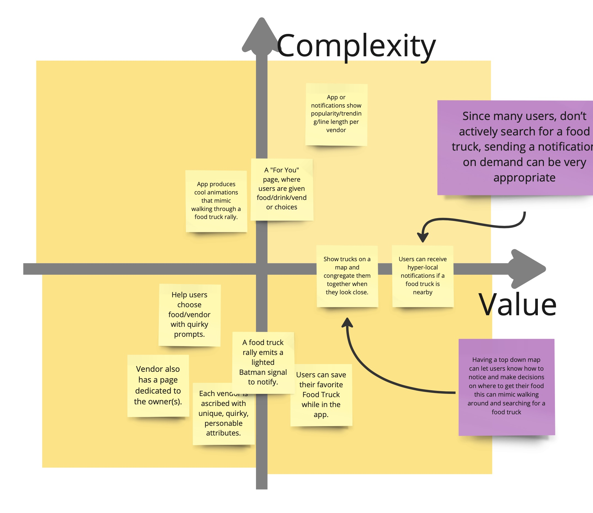

# Food Truck iOS app design

## Overview

- [Research](#research)
  - [Interview](#interview)
  - [Synthesis](#synthesis)
  - [Ideation](#ideation)
  - [Prioritization](#prioritization)
- [Prototype](#prototype)
  - [Sketches](#sketches)
  - [Mockups](#mockups)
  - [Usability Study](#usability-study)
  - [Prototype v2](#prototype-v2)
- [Design](#design)
  - [Style Guide](#style-guide)
  - [Pattern Library](#pattern-library)
  - [High Fidelity Figma mockups](#figma-final-design)

## Research

### Interview

I first interviewed several people...

### Synthesis

...organized all the notes into categories...

### Ideation

...devised some features that could be developed...

### Prioritization

...and found the features that were most impactful for user while also being cost-effective for development.

## Prototype

### Sketches

### Mockups

### Usability Study

### Prototype V2

## Design

### Style Guide

### Pattern Library

### Mood Board

### Figma final design

---

# The End!

### Made with ♡ by [Jordan Lee](www.linkedin.com/in/jordan-chris)

## 

---
